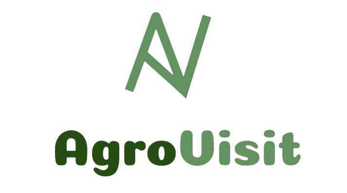
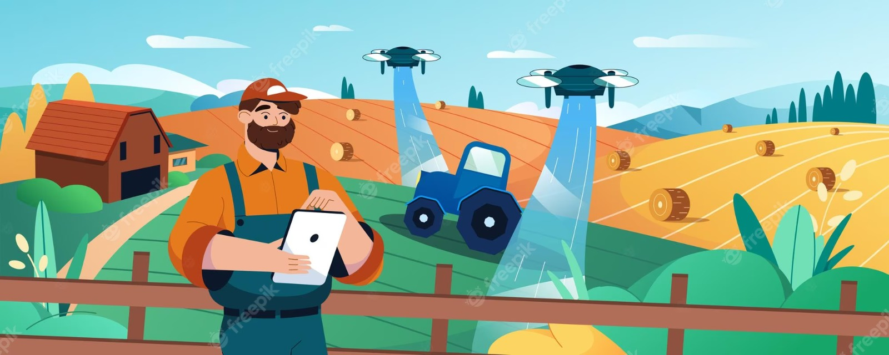

  

Trazendo eficiência e praticidade para sua visita técnica
  
  

  

## Sumário
  <ul id="nav" >
    <li><a href="#problema">1. O Problema</a></li>
    <li><a href="#solucao">2. A Solução</a></li>
    <li><a href="#publico">3. Público Alvo</a></li>
    <li><a href="#video">4. Introdução a ferramenta</a></li>
    <li><a href="#equipe">5. Equipe</a></li>
  </ul>

  <h2 id="problema">1. O Problema :warning:</h2>
  
  
A popularização da tecnologia proporcionou melhorias em diversas áreas, inclusive na área agrícola, sendo utilizada não só por produtores agrícolas, mas também por profissionais das ciências agrárias, sempre em busca do aumento da produtividade.

  
No entanto, muitos dos profissionais atuantes ainda utilizam métodos manuais e pouco eficientes para o registro de suas visitas técnicas, o que pode comprometer a qualidade do serviço prestado.

  
Segundo dados do Conselho Federal de Engenharia e Agronomia (CONFEA, 2018), o número de pessoas habilitadas a atuarem como profissionais do grupo Agronomia totaliza mais de 146 mil profissionais. Desses, 121.781 ou 83 % são Engenheiros Agrônomos.

  
A maior parte das soluções similares existentes são voltadas para grandes proprietários e não focadas em pequenos e médios profissionais agrônomos, o  AgroVisit pode ser uma alternativa mais acessível e conveniente para os agrônomos, que muitas vezes dependem de planilhas e papel para fazer a gestão de suas atividades.

  <h2 id="solucao">2. A Solução :sparkles:</h2>

  
  
  
Na tentiva de solucionar esse problema criamos o <a href="https://github.com/marcosdosea/Agrovisit" >AgroVisit</a>. 

  
O AgroVisit é um software de gerenciamento de visitas técnicas para pequenos e médios agrônomos que visa facilitar o registro de informações sobre propriedades rurais, culturas, serviços prestados e projetos realizados, contribuindo para a tomada de decisões estratégicas e aumento da produtividade agrícola.

  
O AgroVisit oferece soluções de controle de organização e de registro de informações. Nele será possível a visualização de agendamentos e o fluxo do projeto em cada propriedade, armazenando as informações de forma segura e mantendo o processo de visitas de um engenheiro agrônomo muito mais fácil e intuitivo.

  <h2 id="publico">3. Público Alvo :dart:</h2>
  
  
O mercado-alvo do AgroVisit são agrônomos que atendem pequenos e médios proprietários e que necessitam de um aplicativo para gerenciamento de visitas técnicas em propriedades rurais.

  
O software será especialmente útil para profissionais que trabalham de forma autônoma ou em pequenas empresas de consultoria agrícola.

  
  <h2 id="video">4. Introdução a ferramenta :woman_technologist:</h2>

  <h3> Manual do usuário </h3>

  <h3><a href="https://docs.google.com/presentation/d/1zld7rz8qLxVSs_LdbFAfDnjYMaEMUbDK5SWT1kzrnGU/edit?usp=sharing" target="_blank"> Manual do usuário </a></h3>
  
  <h3><a href="https://www.youtube.com/embed/ggKJx6BY9_c?si=2mkXujnKv0o3t2dc"> Video da ferramenta </a></h3>

  <h2 id="equipe">5. Equipe :busts_in_silhouette::busts_in_silhouette: :bust_in_silhouette:</h2>

  <table align="center">
  <tr>
    <td align="center">
      <a href="https://github.com/brunaa-keila" target="_blank">
         
        
          <b>Bruna Keila Oliveira</b>
          
Desenvolvedora

        
      </a>
    </td>
    <td align="center">
      <a href="https://github.com/EduardoSSBispo" target="_blank">
         
        
          <b>Eduardo Santos Santana</b>
          
Desenvolvedor

        
      </a>
    </td>
    <td align="center">
      <a href="https://github.com/Janaina99" target="_blank">
         
        
          <b>Janaina Ferreira</b>
          
Desenvolvedora

        
      </a>
    </td>
    <td align="center" >
      <a href="https://github.com/Thalytacs" target="_blank">
         
        
          <b>Thalyta Costa</b>
          
Desenvolvedora

        
      </a>
    </td>
  </tr>
</table>
<table align="center">
  <tr>
    <td align="center">
      <a href="https://github.com/marcosdosea" target="_blank">
         
        
          <b>Doutor Marcos Dósea</b>
          
PO

        
      </a>
    </td>
   </tr>
</table>
